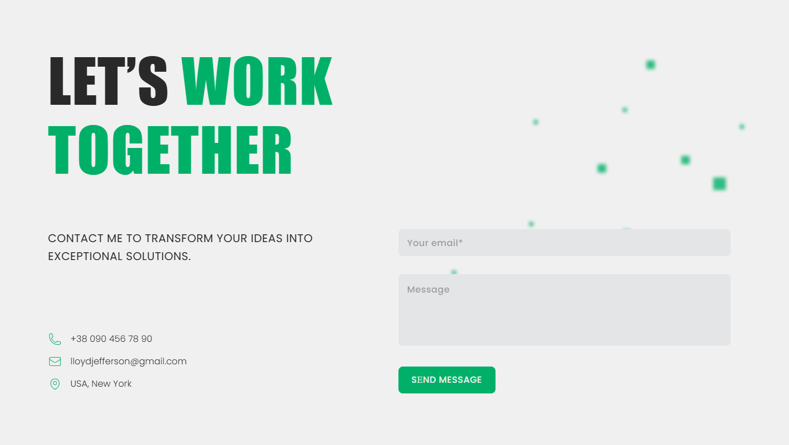

# Team project: portfolio

### Description:

A site that demonstrates the skills, experience and implemented projects of the developer. The site has a stylish and adaptive design, interactive elements, as well as several useful functions, such as the form for the inverse communication, changing the theme of the interface, widgets with frequent questions, skills, reviews customers and more.

---

### Features:

1. **Interface:**

   - Minimalistic and modern design that emphasizes your content.
   - Intuitive navigation through sections: **About me**, **Projects**,
     **Skills**.
   - Creating an Interface in **Figma**, which makes it easy to adapt the site
     to any needs.

2. **Adaptive design:**

   - Automatic adaptation of the site to different screens: mobile phones,
     tablets, desktops.
   - All elements, including fonts and pictures, are adapted for a comfortable
     viewing on any device.

3. **Gallery of projects:**

   - Presentation of your projects in the form of cards .

4. **Communication form:**

   - Implemented form for communication with the developer.
   - The form contains fields for e-mail and a message that allows easy to
     contact you.

5. **Change Theme:**

   - Implemented the ability to change the theme of the interface between
     **day** та **night** modes.
   - Theme selection is saved in **local browser store** and is restored at
     subsequent visits.
   - The first time you log in, the theme is automatically determined by the
     time of day (day or night mode).

6. **Frequently Asked Questions (FAQ):**

   - Section with the most common questions and answers to them, which helps
     users quickly get important information.

7. **Skills:**

   - A section that presents your key skills and skills in various areas.

8. **Customer Reviews:**

   - A section where you can share reviews from satisfied customers or
     colleagues, which increases your reputation.
   - Interactive reviews with the ability to view more comments or ratings.

9. **Animations and Effects:**

   - Using smooth animations for transitions, which makes interaction with the
     site even more pleasant and convenient.

---

### Stages of implementation:

1. **Interface design:**

   - Design layouts in **Figma**, creating a stylish and user-friendly
     interface, that is suitable for different sections of the site.
   - Choice of colors for day and night modes.

2. **Development of functionality:**

   - Use **HTML5** for site structure.
   - Styling your site with **CSS3**.
   - Implementing dynamic elements with **JavaScript**.

3. **Testing and Publishing:**

   - Test features across devices and browsers.
   - Publish to **GitHub Pages** for hosting.
   - Checking the operation of the feedback form and automatically changing the
     topic.

---

### Advantages of using:

- Stylish design and adaptability for any device.
- Easy access to your contact information and the ability to quickly contact by
  you are through the feedback form.
- Dynamically change the theme depending on the time of day or user choice.
- Presentation of your skills, customer reviews and frequent questions in a
  convenient format.
- Smooth animations and interactive elements that improve interaction with the
  site.

---

### Technologies used:

1. **Programming languages and technologies:**

   - **HTML5** — for site structure.
   - **CSS3** — for site styling.
   - **JavaScript** — for dynamic elements and user interaction.

2. **Tools:**

   - **GitHub** — for version control and collaboration.
   - **Figma** — to create an interface design.

3. **Other tools:**
   - **GitHub Pages** — to publish the site.

---

This site is your personal tool for presenting yourself on the Internet that
combines stylish design with many features for user convenience. Thanks to
adaptability and intuitive interface, it will be great tool to find new
customers or employers.
